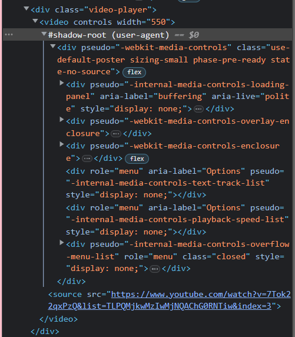

# Shadow DOM 

Shadow DOM is used to create custom components, i.e Web components.

## Benefits

CSS of application doesn't affect the CSS of the shadow DOM.


```html
<div class="video-player">
    <video controls="" width="550"> <source src=""></video>
</div>
```

After enabling shadow DOM in chrome settings, we have  

