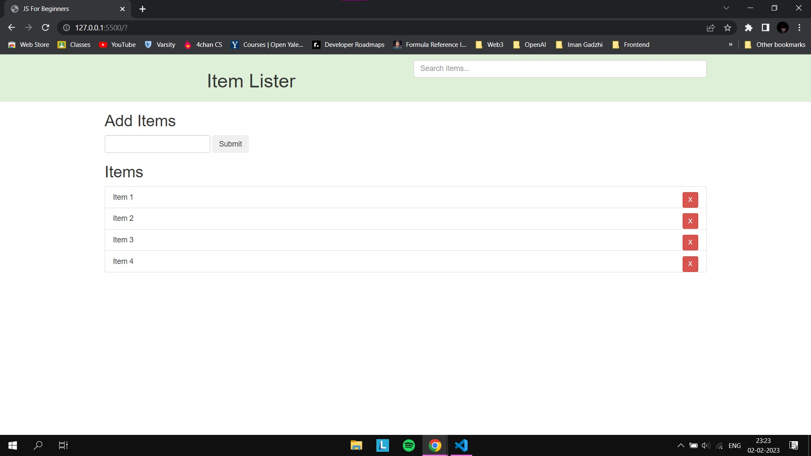
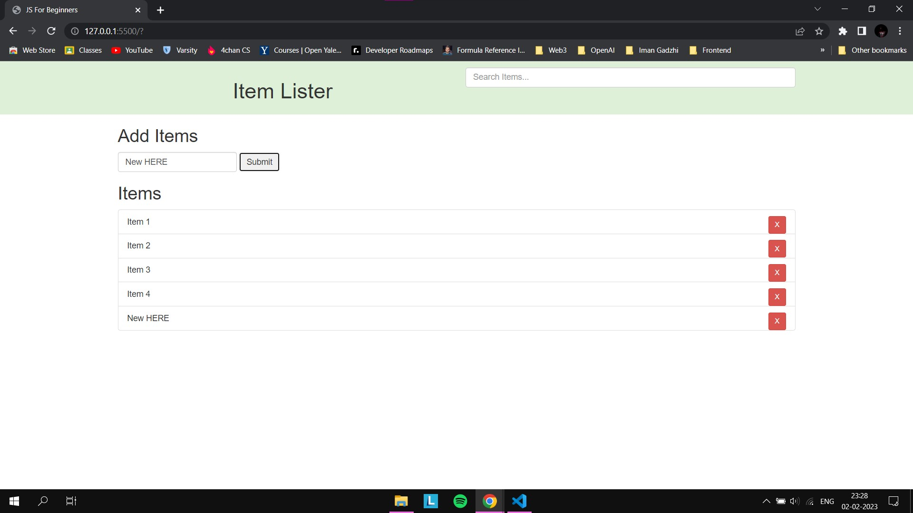
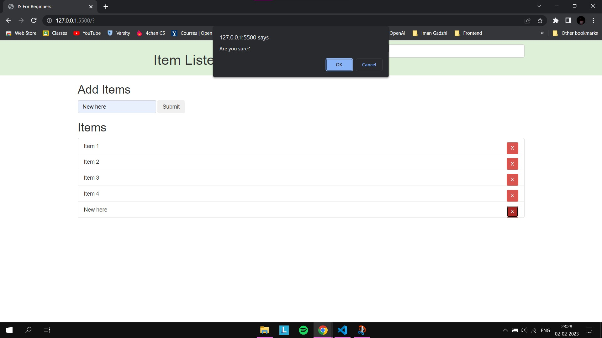
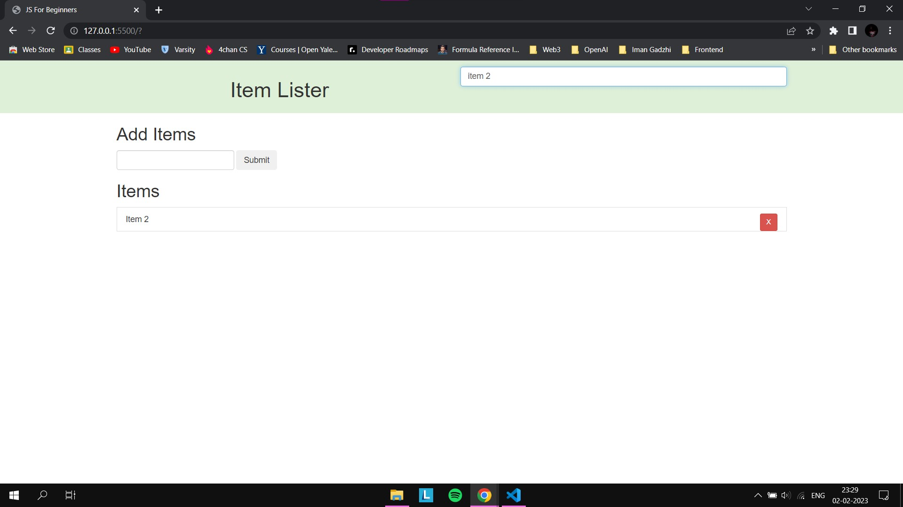

# Javascript Crash Course

Built a basic input form with the following features:

* addition of elements
* deletion of elements
* filter elements by name

## Source :  
<a href="https://youtu.be/hdI2bqOjy3c" target="_blank">Traversy Media Video</a>  
<a href="https://www.youtube.com/playlist?list=PLillGF-RfqbbnEGy3ROiLWk7JMCuSyQtX" target="_blank">Traversy Media Playlist</a>  
<a href="https://youtu.be/Jqn_wjkSZwo" target="blank">import / export (modules) - Beau teaches JavaScript
</a>
## Brushed up on concepts such as:
* Basic Datatypes
* Strings and String methods
* Arrays
* Object literals 
* Array of Objects and Json
* Higher Order Array Methods
* Conditionals
* Functions
* Arrow functions
* Constructor Functions and prototypes
* ES6 classes
* Window Object and DOM
* DOM selection
* DOM manipulation
* Events
* Spread and Rest operator
* import/export modules
## Website

  

